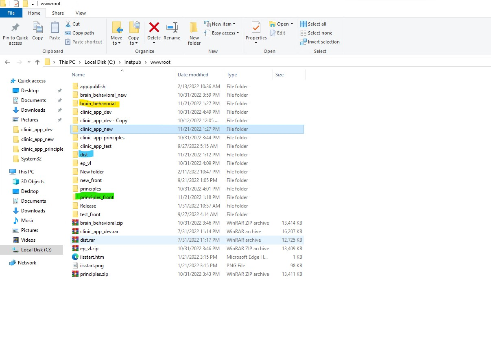

## IDE+version: VS Code 1.73.1

- <a href="https://code.visualstudio.com">Sitio Web Visual Studio Code</a>
- <a href="https://code.visualstudio.com/download">Download Visual Studio Code</a>

## Pasos para configurar el proyecto y que corra localmente

1. Instalar nodeJs <a href="https://nodejs.org/en/download/"> Download NodeJs</a>
2. Ejecutar comando: <code> npm install </code>
3. Cambiar <code>environments/environments.ts</code> y apuntar al endpoint del backend.
4. Ejecutar comando: <code> ng serve -o</code>

## Como crear el paquete para subir al servidor la ultima version

1. Cambiar <code>environments/environments.prod.ts</code> y apuntar al endpoint del backend de la compañía deseada.
2. Ejecutar comando: <code>ng build --prod</code>

## Identificar el(los) servidor(es) para desplegar el paquete

*Todas las compañías se encuentran desplegadas en el mismo servidor. Puede acceder mediante escritorio remoto a la URL: <code>ec2-34-228-60-99.compute-1.amazonaws.com</code>*

*Para desplegar la aplicación frontend de cada una de las compañías, copiar el contenido de la carpeta dist a la carpeta correspondiente en el servidor.*

<b>Distribución de carpetas del frontend por compañías en el server.</b>

Brain & Behavioral

Expanding & Villa Lyan 

Principles

</img>